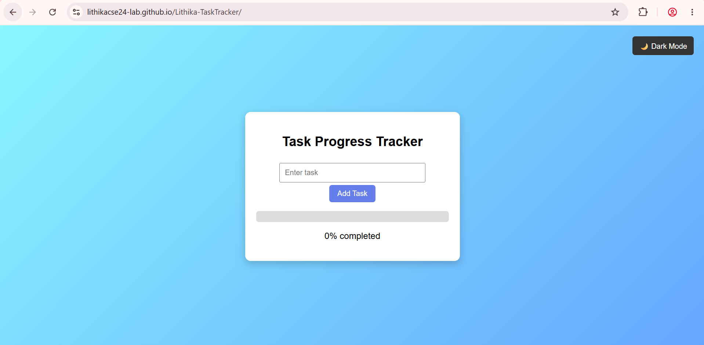
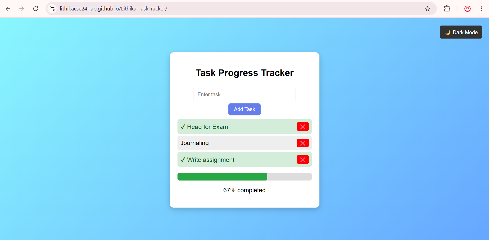
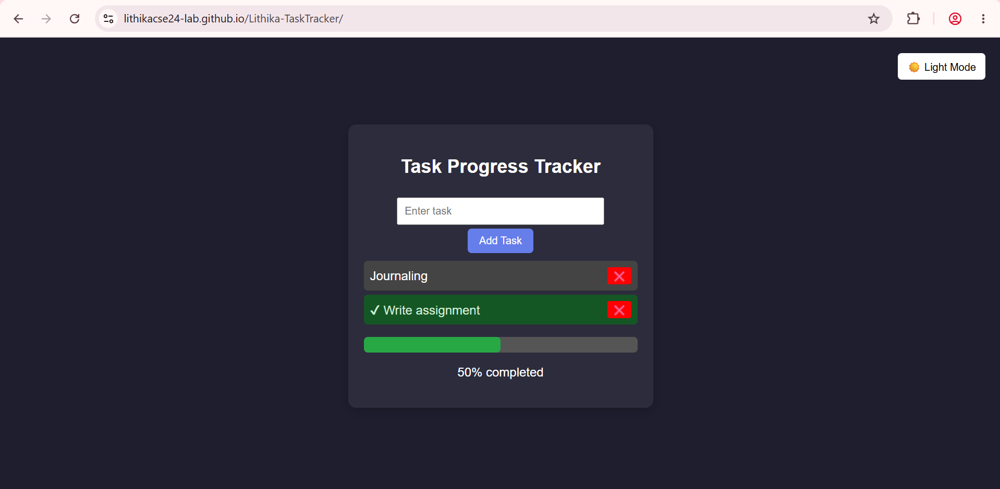

# 📝 Task Tracker Web App

- A simple and interactive **Task Tracker Web App** that helps you organize and manage your daily tasks efficiently.
- This project demonstrates my front-end development skills by building a clean, responsive, and user-friendly application using **HTML, CSS, and JavaScript**.

## 🌐 Live Demo
🔗 **Try the app here:** https://lithikacse24-lab.github.io/Lithika-TaskTracker/
> **Deployment:** Hosted using **GitHub Pages**

## 🚀 Features
- ➕ **Add Tasks** – Quickly create and organize new tasks.
- ✅ **Mark as Complete** – Keep track of completed tasks with a single click.
- 🗑️ **Delete Tasks** – Remove tasks that are no longer needed.
- 📊 **Task Completion Progress** – Displays the percentage of completed tasks.
- 📱 **Responsive Design** – Optimized for both desktop and mobile devices.

## 🛠️ Technologies Used
- HTML5
- CSS3
- JavaScript (ES6)

## 📂 Project Structure
```
Task-Tracker/
|__ screenshots/
|   └── home-lightmode.png
|   └── tasks-progress-lightmode.png
|   └── delete-darkmode.png
│── index.html
│── style.css
│── script.js
└── README.md
```
## 📸 Screenshots
### 🏠 Home (Light Mode)

### 📊 Tasks & Progress

### 🌙 Delete Task (Dark Mode)


**⭐ If you found this project useful, please consider giving it a star on GitHub!**
